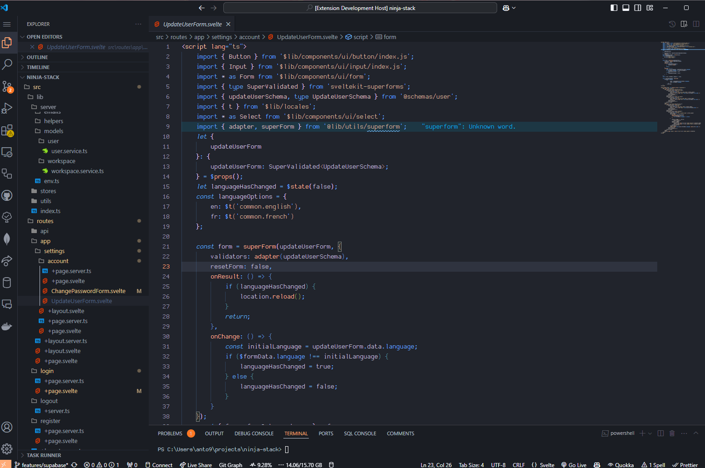

# Svelte 5 Theme

A modern and minimal theme inspired by Svelte for an improved coding experience. Designed with Svelte developers in mind, this theme highlights syntax and provides a clean, distraction-free environment for writing Svelte, JavaScript, TypeScript, and other web development languages.



## Features

- **Optimized for Svelte**: Syntax highlighting that enhances the readability of Svelte components and its HTML, CSS, and JavaScript integrations.
- **Minimal and Clean Design**: A balanced color palette that helps reduce eye strain while keeping the focus on your code.
- **Support for Multiple Languages**: Full support for HTML, CSS, JavaScript, TypeScript, JSON, Markdown, and more.
- **Customizable**: Easily tweak the theme's colors and settings according to your preferences.

## Installation

1. Open **Visual Studio Code**.
2. Go to the **Extensions** view by clicking on the Extensions icon in the Activity Bar on the side of the window.
3. Search for `Svelte 5 Theme`.
4. Click **Install**.

Once installed, go to the **Color Theme** dropdown menu in the Command Palette (`Ctrl+Shift+P`), and select **Svelte 5 Theme** to activate the theme.

## Customization

To personalize the theme, add the following to your `settings.json`:

```json
"workbench.colorCustomizations": {
    "[Svelte 5 Theme]": {
        "editor.background": "#1e1e1e",
        "editor.foreground": "#d4d4d4"
    }
}
